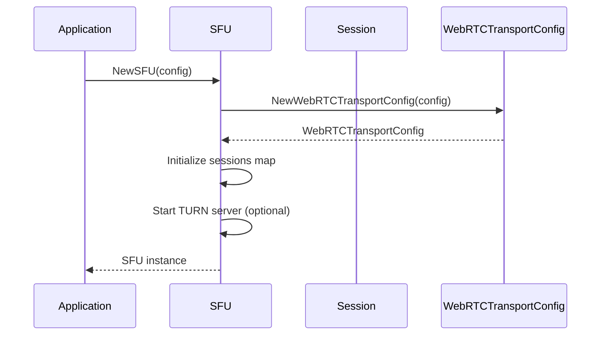
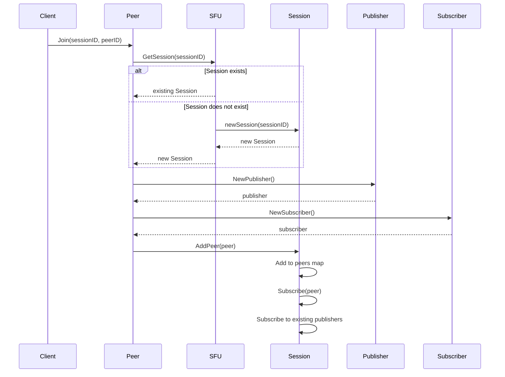
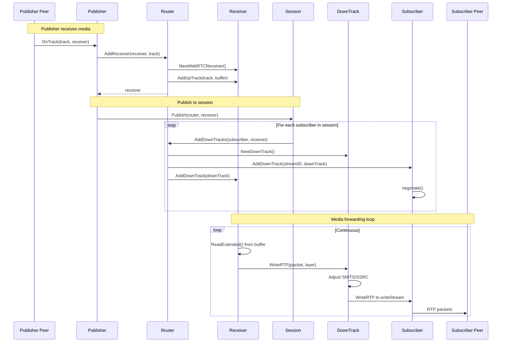
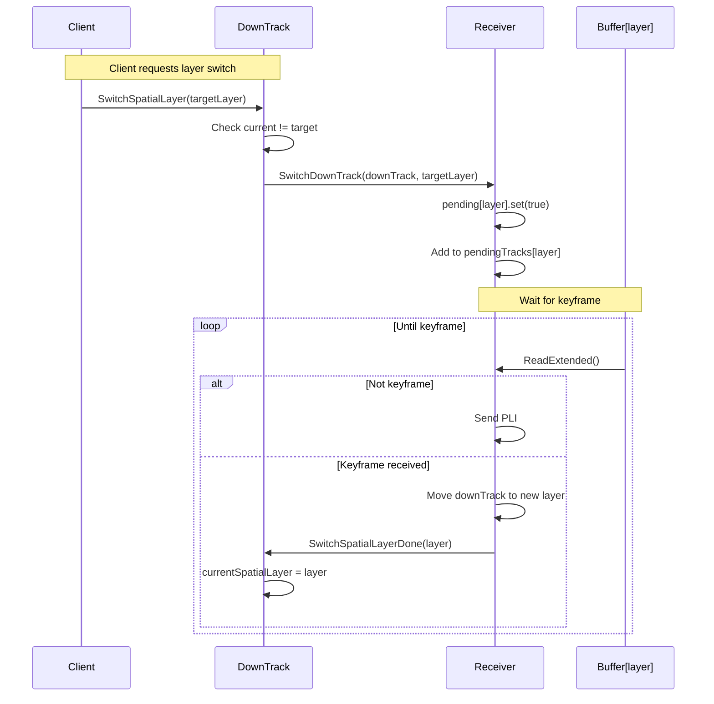
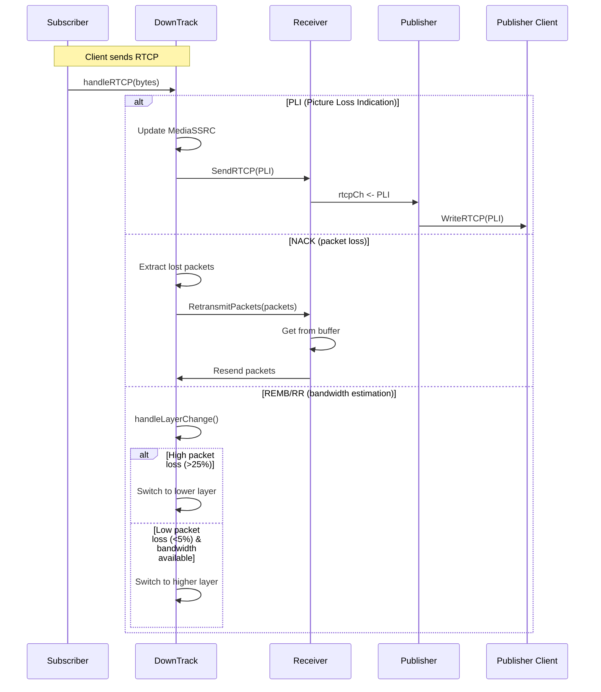
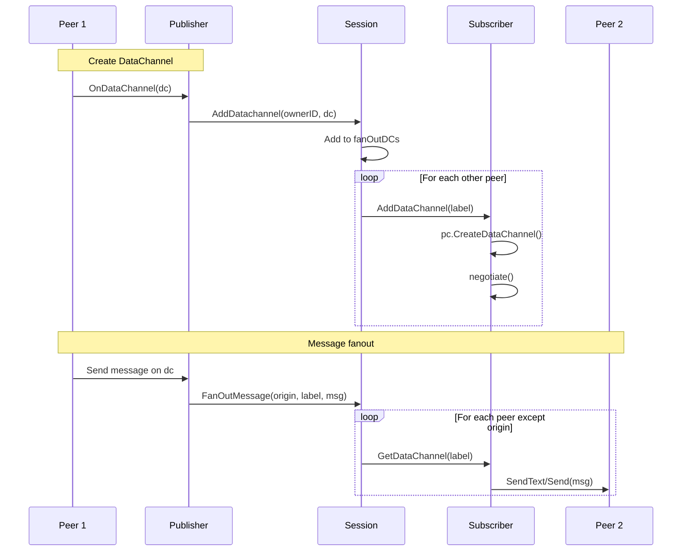
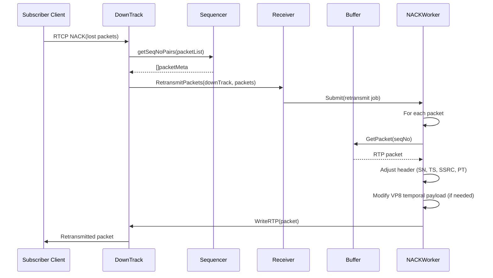
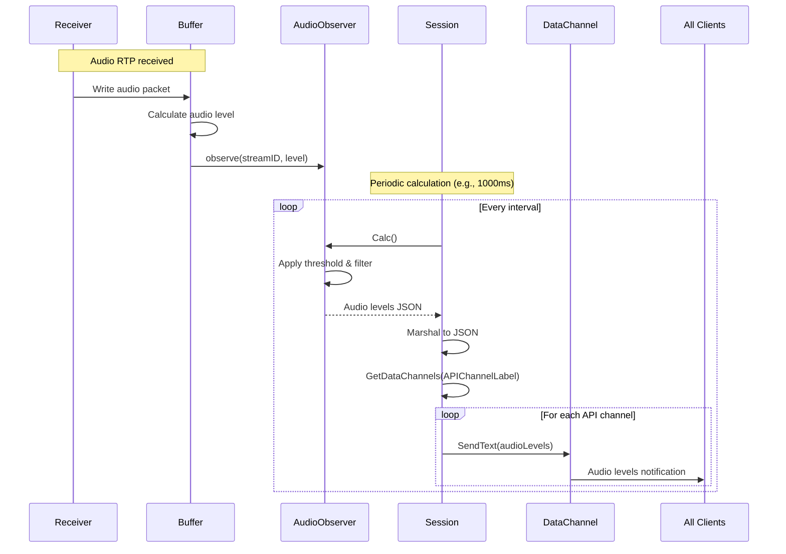
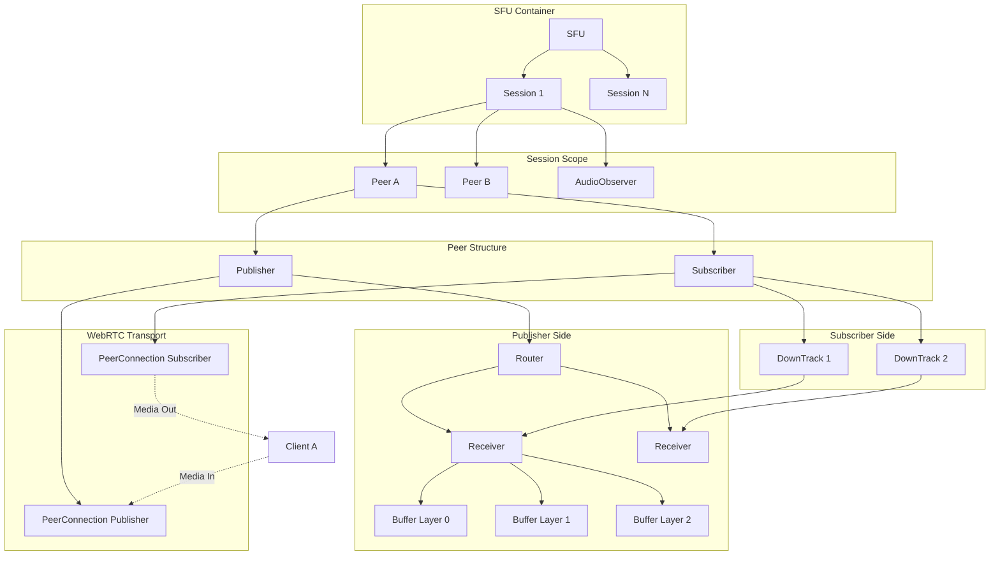

# ion-sfu アーキテクチャとフロー詳細解説

## 概要

ion-sfuは、WebRTC Selective Forwarding Unit (SFU)のGo実装です。SFUはメディアストリームをトランスコードせずに、複数のピア間でRTPパケットをルーティング・転送します。

## コア概念とアーキテクチャ

### 1. SFU (Selective Forwarding Unit)

**責務**: システム全体のエントリーポイントとライフサイクル管理

- すべてのセッションを管理
- WebRTC設定（ICE、STUN/TURN）の初期化
- オプショナルなTURNサーバーの起動
- データチャネルの登録

**ファイル**: `pkg/sfu/sfu.go`

**構造**:

```go
type SFU struct {
    webrtc       WebRTCTransportConfig  // ピア接続作成用の設定
    turn         *turn.Server           // オプションのTURNサーバー
    sessions     map[string]Session     // セッションマップ
    datachannels []*Datachannel        // 登録されたデータチャネル
    withStats    bool                   // 統計収集フラグ
}
```

### 2. Session

**責務**: ピアのグループ化とメディアルーティングスコープの提供

- セッション内のピア管理（追加・削除・検索）
- パブリッシャーのメディアをサブスクライバーに配信
- 音声レベル監視（誰が話しているか）
- データチャネルのファンアウト

**ファイル**: `pkg/sfu/session.go`

**構造**:

```go
type SessionLocal struct {
    id           string                    // セッションID
    peers        map[string]Peer           // ピアマップ
    relayPeers   map[string]*RelayPeer    // リレーピア（SFU間通信用）
    audioObs     *AudioObserver           // 音声レベル監視
    fanOutDCs    []string                 // ファンアウトデータチャネルラベル
    datachannels []*Datachannel          // データチャネルミドルウェア
}
```

### 3. Peer

**責務**: クライアント接続の抽象化（Pub/Subモデルの実装）

各ピアは通常2つのWebRTC PeerConnectionを持ちます：

- **Publisher接続**: ピア→SFUへのメディア送信
- **Subscriber接続**: SFU→ピアへのメディア送信

**ファイル**: `pkg/sfu/peer.go`

**構造**:

```go
type PeerLocal struct {
    id         string
    session    Session
    publisher  *Publisher    // メディア送信用
    subscriber *Subscriber   // メディア受信用
    
    OnOffer                    func(*webrtc.SessionDescription)
    OnIceCandidate             func(*webrtc.ICECandidateInit, int)
    OnICEConnectionStateChange func(webrtc.ICEConnectionState)
}
```

### 4. Publisher

**責務**: ピアからのメディア受信とセッション内への配信

- 着信メディアトラックの検出とReceiver作成
- Routerへのトラック登録
- セッション内の全サブスクライバーへの自動配信
- データチャネルの処理
- リレー機能（SFU間のメディア転送）

**ファイル**: `pkg/sfu/publisher.go`

**構造**:

```go
type Publisher struct {
    id         string
    pc         *webrtc.PeerConnection
    router     Router                    // メディアルーティング
    session    Session
    tracks     []PublisherTrack         // トラックとReceiverのペア
    relayPeers []*relayPeer             // リレーピア
}
```

### 5. Subscriber

**責務**: ピアへのメディア配信管理

- DownTrackの管理（送信トラック）
- SDPネゴシエーション（デバウンス付き）
- データチャネル管理
- RTCP Sender Reportの定期送信

**ファイル**: `pkg/sfu/subscriber.go`

**構造**:

```go
type Subscriber struct {
    id       string
    pc       *webrtc.PeerConnection
    tracks   map[string][]*DownTrack   // ストリームIDごとのダウントラック
    channels map[string]*webrtc.DataChannel
    negotiate func()                    // デバウンスされたネゴシエーション
}
```

### 6. Router

**責務**: メディアストリームのルーティングロジック

- Receiver管理（トラックID検索、Simulcastサポート）
- DownTrack作成と管理
- RTCPフィードバック処理（PLI/FIR/TWCC）
- 統計収集

**ファイル**: `pkg/sfu/router.go`

**構造**:

```go
type router struct {
    id            string
    twcc          *twcc.Responder        // Transport-wide CC
    rtcpCh        chan []rtcp.Packet     // RTCPチャネル
    session       Session
    receivers     map[string]Receiver    // トラックIDでインデックス
    bufferFactory *buffer.Factory
}
```

### 7. Receiver

**責務**: 着信RTPストリームの処理とダウントラックへの配信

- RTPパケットの受信と配信
- Simulcast/SVCレイヤー管理（最大3レイヤー: q, h, f）
- NACK処理とパケット再送
- ダウントラック管理（レイヤーごと）

**ファイル**: `pkg/sfu/receiver.go`

**構造**:

```go
type WebRTCReceiver struct {
    peerID      string
    trackID     string
    streamID    string
    buffers     [3]*buffer.Buffer        // Simulcastレイヤーごと
    upTracks    [3]*webrtc.TrackRemote   // アップストリームトラック
    downTracks  [3]atomic.Value          // []*DownTrack
    nackWorker  *workerpool.WorkerPool   // NACK処理用
    isSimulcast bool
}
```

### 8. DownTrack

**責務**: サブスクライバーへのRTP送信

- RTPパケットの送信（シーケンス番号/タイムスタンプ調整）
- Simulcast処理（空間/時間レイヤー切り替え）
- 適応的ビットレート制御
- RTCP処理（PLI/FIR/NACK）

**ファイル**: `pkg/sfu/downtrack.go`

**構造**:

```go
type DownTrack struct {
    id                  string
    peerID              string
    ssrc                uint32
    sequencer           *sequencer
    trackType           DownTrackType      // Simple or Simulcast
    currentSpatialLayer int32
    targetSpatialLayer  int32
    temporalLayer       int32
    receiver            Receiver
    writeStream         webrtc.TrackLocalWriter
}
```

## フロー詳細

### 1. 初期化フロー



### 2. ピア参加フロー



### 3. メディア配信フロー（Publish & Subscribe）



### 4. Simulcast レイヤー切り替えフロー



### 5. RTCP フィードバックフロー



### 6. データチャネルフロー



### 7. NACK処理とパケット再送フロー



### 8. 音声レベル監視フロー



## 全体フロー図



## コンポーネント相互作用マトリックス

| From/To | SFU | Session | Peer | Publisher | Subscriber | Router | Receiver | DownTrack |
|---------|-----|---------|------|-----------|------------|--------|----------|-----------|
| **SFU** | - | Create, Manage | - | - | - | - | - | - |
| **Session** | Register/Unregister | - | Add, Remove, Subscribe | Publish to | - | - | - | - |
| **Peer** | GetSession | Join, Leave | - | Create | Create | - | - | - |
| **Publisher** | - | Publish, AddDatachannel | - | - | - | AddReceiver | - | - |
| **Subscriber** | - | - | Negotiate | - | - | AddDownTracks | - | AddDownTrack |
| **Router** | - | - | - | - | Create DownTracks | - | AddReceiver, AddDownTrack | Create |
| **Receiver** | - | AudioObserver | - | - | - | RTCP | - | WriteRTP, RetransmitPackets |
| **DownTrack** | - | - | - | - | Negotiate | - | SendRTCP, SwitchLayer | - |

## Simulcast レイヤー管理

### レイヤー定義

```text
Layer 2 (High): Full resolution (f)
Layer 1 (Mid):  Half resolution (h)
Layer 0 (Low):  Quarter resolution (q)
```

### レイヤー切り替え条件

**アップスイッチ（より高品質へ）**:

- パケットロス ≤ 5%
- 利用可能帯域幅 ≥ 現在のビットレートの150%
- スイッチディレイ経過（頻繁な切り替え防止）

**ダウンスイッチ（より低品質へ）**:

- パケットロス ≥ 25%
- 利用可能帯域幅 ≤ 現在のビットレートの62.5%

### VP8 時間レイヤーフィルタリング

DownTrackはVP8のTL0PICIDXとPictureIDを使用して時間レイヤーをフィルタリングします：

```text
TL2: ●━━●━━●━━●━━●  (すべてのフレーム)
TL1: ●━━━━━●━━━━━●  (1/2のフレーム)
TL0: ●━━━━━━━━━━━●  (1/4のフレーム - ベースレイヤー)
```

## パケットフロー概要

### パブリッシャー → サブスクライバー

```text
Client A (Publisher)
    ↓ RTP
PeerConnection (Publisher)
    ↓ OnTrack
Publisher.OnTrack
    ↓ AddReceiver
Router
    ↓ Create
Receiver
    ↓ AddUpTrack
Buffer[layer] (NACK, Reorder, Stats)
    ↓ ReadExtended
Receiver.writeRTP
    ↓ WriteRTP
DownTrack[per subscriber]
    ↓ Adjust (SN, TS, SSRC)
DownTrack.writeStream
    ↓ RTP
PeerConnection (Subscriber)
    ↓ RTP
Client B (Subscriber)
```

## バッファとパケット処理

### Buffer の責務

`pkg/buffer/` パッケージは以下を提供：

- **パケットバッファリング**: 受信パケットの保存とリオーダリング
- **NACK処理**: 失われたパケットの検出と再送要求
- **統計収集**: ビットレート、パケットロス、ジッター
- **TWCC処理**: Transport-wide Congestion Control

### パケット処理パイプライン

```text
RTP Packet
    ↓
Buffer.Write()
    ↓
Store in bucket (bucket = SN % bucketSize)
    ↓
Update statistics (bitrate, timestamp)
    ↓
Detect audio level (for audio)
    ↓
TWCC callback (for video)
    ↓
Buffer.ReadExtended()
    ↓
ExtPacket (with metadata)
```

## RTCP処理

### フィードバックタイプ

**PLI (Picture Loss Indication)**:

- クライアントがデコードエラーを検出
- DownTrack → Receiver → Publisher → Source Client

**FIR (Full Intra Request)**:

- 完全なキーフレーム要求
- 処理フローはPLIと同様

**NACK (Negative Acknowledgement)**:

- 特定パケットの再送要求
- Sequencerがソースシーケンス番号にマッピング
- Bufferから再送

**REMB (Receiver Estimated Maximum Bitrate)**:

- クライアントの推定受信帯域幅
- レイヤー切り替えの判断に使用

**TWCC (Transport-wide Congestion Control)**:

- パケット到着時刻ベースの輻輳制御
- Responderがフィードバックを生成

## データチャネル

### タイプ

**API Channel** (`ion-sfu`):

- Publisher側で終端
- 音声レベル通知などのシグナリング用

**ファンアウトチャネル**:

- セッション内の全ピアに配信
- カスタムアプリケーションメッセージ用

**ミドルウェアチェーン**:

- データチャネルメッセージにミドルウェアパターンを適用
- 認証、検証、ロギングなどに使用可能

### ミドルウェア処理フロー

```text
Message Received
    ↓
Middleware 1 (e.g., Auth)
    ↓
Middleware 2 (e.g., Validation)
    ↓
Middleware N (e.g., Logging)
    ↓
onMessage handler
    ↓
FanOut (if configured)
```

## リレー機能（SFU間通信）

### リレーピア

SFUは他のSFUインスタンスとカスケード接続可能：

```text
SFU A (Publisher's SFU)
    ↓ Relay Peer
SFU B (Remote SFU)
    ↓ RelayPeer in Session
Subscribers in SFU B
```

### リレートラック作成

1. Publisher.Relay() が呼ばれる
2. relay.Peer 作成
3. 各PublisherTrackに対してDownTrackを作成
4. relay.Peer.AddTrack()
5. 定期的なSender Report送信（オプション）

## 統計収集

### 収集される統計

- **Stream統計**: ビットレート、パケット数、バイト数
- **ドリフト計算**: 複数ストリーム間の同期ずれ
- **CNAME**: Sender Reportから抽出
- **グローバル統計**: セッション数、ピア数、トラック数

### 統計の使用箇所

- レイヤー切り替え判断
- QoSモニタリング
- デバッグとトラブルシューティング

## 最適化とパフォーマンス

### パケットファクトリー

```go
packetFactory = &sync.Pool{
    New: func() interface{} {
        b := make([]byte, 1460)
        return &b
    },
}
```

頻繁なメモリアロケーションを防ぐためのバイトバッファプール。

### バラストメモリ

GCヒューリスティックを調整し、GC頻度を減少：

```go
ballast := make([]byte, config.Ballast*1024*1024)
runtime.KeepAlive(ballast)
```

### ネゴシエーションのデバウンス

Subscriberは250msのデバウンスを使用し、複数のトラック追加を1回のネゴシエーションにバッチ処理。

### NACKワーカープール

Receiverはワーカープールを使用してNACK処理を非同期化。

## エラーハンドリングと回復

### ICE接続状態

```text
Connected → Disconnected
    ↓ (timeout)
Failed/Closed
    ↓
Peer.Close()
    ↓
Session.RemovePeer()
    ↓
(Session empty?) → Session.Close()
```

### キーフレーム待機

レイヤー切り替えやリシンク時、DownTrackはキーフレームを待機：

- キーフレームでない場合、パケットを破棄しPLI送信
- キーフレーム受信でスイッチを完了

## セキュリティ考慮事項

- **DTLS**: WebRTCの組み込み暗号化
- **TURN認証**: カスタム認証関数サポート
- **データチャネルミドルウェア**: メッセージ検証とフィルタリング
- **リソース制限**: MaxPacketTrack などの制限

## まとめ

ion-sfuは以下の階層で構成されます：

1. **SFU**: システムエントリーポイント
2. **Session**: ピアグループとルーティングスコープ
3. **Peer**: クライアント抽象化（Publisher + Subscriber）
4. **Publisher**: メディア受信とルーティング
5. **Subscriber**: メディア配信
6. **Router**: ルーティングロジック
7. **Receiver**: 着信ストリーム処理
8. **DownTrack**: 送信トラック（適応的制御付き）

各コンポーネントは明確な責務を持ち、疎結合で拡張可能なアーキテクチャを実現しています。Simulcastサポート、適応的ビットレート制御、効率的なパケット処理により、スケーラブルなWebRTC SFUを提供します。
